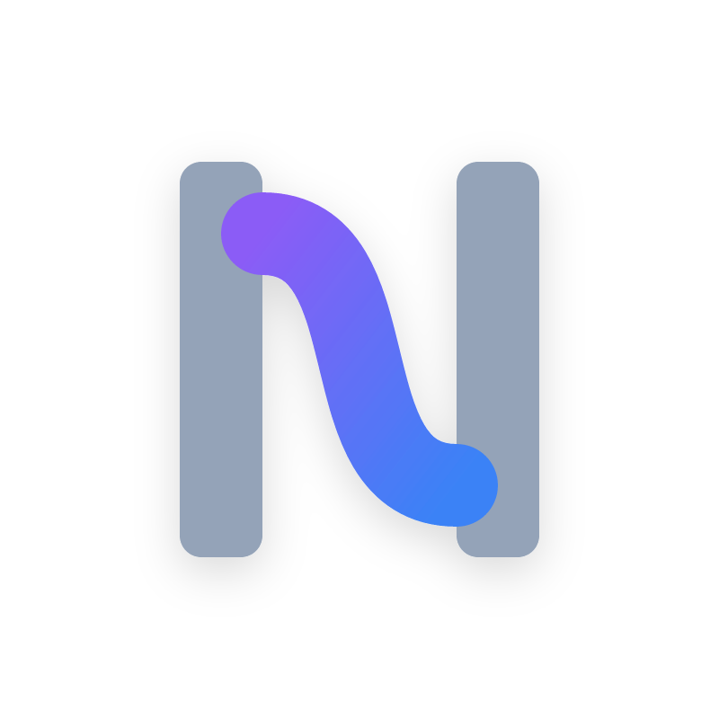

<div align="center">
  
  <h1>Nexa Language 官方中文文档</h1>
  <p><b><i>探索智能体原生 (Agent-Native) 编程新纪元。写流程，而非胶水代码。</i></b></p>
  <p>
    
    
    
  </p>
</div>

---

## ⚡ 关于本文档仓库

本仓库包含 **[Nexa](https://github.com/your-org/nexa)** 智能体原生 (Agent-Native) 编程语言的详尽官方中文文档。

当代 AI 应用开发充斥着大量的 Prompt 拼接与臃肿的解析套件。Nexa 将意图路由、多智能体并发组装、管道流传输等核心语法提升为一等公民。在这个文档项目中，我们从原理到实践深度拆解了 Nexa 背后强大的机制。

所有文档支持 Material for MkDocs 框架，并自动内嵌 Giscus Discussions 讨论区。

## 📖 文档概览

我们的教程架构分为多个层级，从完全入门到编译器底层的剖析：

- 🧭 **1. 前言与理念 (Preface)**：介绍 Nexa 的诞生背景及对 Python 开发 Agent 痛点的解决思路。
- 🧱 **2. 基础语法 (Basic Syntax)**：涵盖 Agent 声明、系统模块、路由机制的基本使用。
- 🔧 **3. 高级特性 (Advanced Features)**：解读管道操作 (`>>`)、意图路由机制、以及数据汇聚的抽象。
- 🧩 **4. 语法扩展 (Syntax Extensions)**：探讨 Protocols 协议支持与多模型网络协同编排。
- 🔮 **5. 未来展望 (Future Outlook)**：揭秘核心开发路线上的资源控制与状态推演。
- 🏗️ **6. 编译器设计 (Compiler Design)**：剥开 AST（抽象语法树）分析器和高并发执行调度引擎的内幕。
- 💡 **7. 最佳实践 (Best Practices)**：Token节省、调试指南与企业级落地的典范代码。
- 🌐 **8. 社区与生态 (Community & Ecosystem)**：如何为主件项目贡献及探索原生第三方包的拓展。

## 🚀 本地运行与开发

本仓库使用 `MkDocs` 以 `Material` 模版进行构建。如果你希望在本地实时预览文档：

### 1. 环境准备
```bash
# 建议在虚拟环境中运行
pip install mkdocs mkdocs-material
```

### 2. 启动本地构建
```bash
# 进入本仓库根目录并启动服务器
mkdocs serve
```
随后，可通过浏览器访问 `http://127.0.0.1:8000` 获得丝滑的预览体验。页面底部配有完备的 Giscus 互动入口。

### 3. 生成静态产物
若是希望部署到 GitHub Pages 等静态托管：
```bash
mkdocs build
```

## 💬 评论与反馈

我们为文档的每一个子页都在底部集成了 [Giscus](https://giscus.app/zh-CN) 评论区。您可以直接使用 GitHub 账号登录并在对应段落提出见解。所有的评论都将汇聚于此仓库的 Discussions 面板中，欢迎探讨交流！

---
<div align="center">
  <sub>Built with ❤️ by the Nexa Genesis Team for the next era of automation.</sub>
</div>
