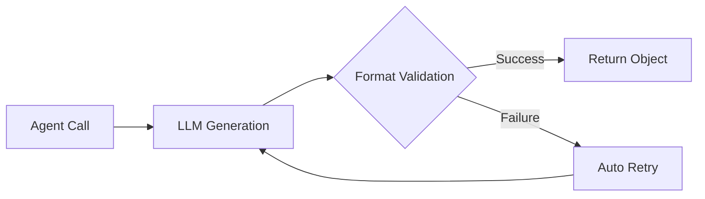

# Quickstart: Master Nexa Basics in 30 Minutes

Welcome to Nexa! This tutorial will guide you from scratch to mastering Nexa's core concepts and basic usage in 30 minutes.

---

## 📋 Prerequisites

### 1. System Requirements

| Item | Requirement |
|-----|-----|
| Python | ≥ 3.10 |
| Operating System | Linux / macOS / Windows (WSL) |
| Memory | ≥ 4GB |

### 2. Install Nexa

```bash
# Clone the repository
git clone https://github.com/your-org/nexa.git
cd nexa

# Install dependencies (recommended in a virtual environment)
pip install -e .
```

### 3. Configure API Keys

Nexa requires API keys for large language models to run. Create a `secrets.nxs` file:

```bash
# Create the key file in the project root
cat > secrets.nxs << 'EOF'
OPENAI_API_KEY = "sk-your-openai-key"
DEEPSEEK_API_KEY = "sk-your-deepseek-key"
MINIMAX_API_KEY = "your-minimax-key"
EOF
```

!!! warning "Security Notice"
    - **Never** commit `secrets.nxs` to Git
    - This file is already configured in `.gitignore`, ensure it's not accidentally committed

### 4. Verify Installation

```bash
# Check if installation was successful
nexa --version

# Should output something like: Nexa v1.0-alpha
```

---

## 🎯 Core Concepts Overview

Before we start coding, let's quickly understand Nexa's three core concepts:

### Concept 1: Agent

**What is an Agent?**

An Agent is a "first-class citizen" in Nexa, representing an AI assistant with specific capabilities. You can think of it as a "role" that has:

- **Role** (role): Who it is
- **System Prompt** (prompt): What it should do
- **Model** (model): Which LLM it uses
- **Tools** (tools): What tools it can use (optional)

```nexa
// Simplest Agent definition
agent Greeter {
    role: "Friendly greeting assistant",
    prompt: "You are a warm and friendly assistant, helping users with concise language.",
    model: "deepseek/deepseek-chat"
}
```

### Concept 2: Flow

**What is a Flow?**

A Flow is an Agent's workflow and the entry point for program execution. Similar to the `main` function in other languages.

```nexa
flow main {
    // This is the main logic of the program
    result = Greeter.run("Hello!");
    print(result);
}
```

### Concept 3: Protocol

**What is a Protocol?**

A Protocol is used to constrain an Agent's output format, ensuring structured data is returned. This is important when you need to pass Agent output to other systems.

```nexa
// Define an output protocol
protocol UserInfo {
    name: "string",
    age: "int",
    interest: "string"
}

// Agent implements this protocol
agent InfoExtractor implements UserInfo {
    prompt: "Extract personal information from user input"
}
```

---

## 🚀 Exercise 1: Hello World

Let's write our first Nexa program!

### Step 1: Create Project File

```bash
mkdir -p my-first-nexa
cd my-first-nexa
```

### Step 2: Write Code

Create file `hello.nx`:

```nexa
// hello.nx - Your first Nexa program

// Define a simple Agent
agent HelloBot {
    role: "Enthusiastic greeting robot",
    prompt: "You are a friendly assistant. Respond to users with warm, concise language, no more than 50 words.",
    model: "deepseek/deepseek-chat"
}

// Main flow
flow main {
    // Call the Agent
    response = HelloBot.run("Hello, please introduce yourself!");
    
    // Output the result
    print(response);
}
```

### Step 3: Run the Program

```bash
nexa run hello.nx
```

### Expected Output

```
Hello! I'm HelloBot, a warm and friendly AI assistant! Nice to meet you, how can I help you? 😊
```

!!! success "Congratulations!"
    You have successfully run your first Nexa program!

---

## 🛠️ Exercise 2: Agent with Tools

In real applications, Agents usually need to call external tools. Let's add a calculator tool to an Agent.

### Complete Code

Create file `calculator.nx`:

```nexa
// calculator.nx - Agent with tool example

// Define tool (simplified version)
tool Calculator {
    description: "Perform mathematical calculations, supports addition, subtraction, multiplication, and division",
    parameters: {
        "expression": "string  // Mathematical expression, e.g. '2+3*4'"
    }
}

// Define Agent that uses this tool
agent MathAssistant uses Calculator {
    role: "Math Assistant",
    prompt: """
    You are a math assistant. When users need to perform calculations, use the Calculator tool.
    After calculation, explain the result in concise language.
    """,
    model: "deepseek/deepseek-chat"
}

flow main {
    // User question
    question = "Please help me calculate (123 + 456) * 2?"
    
    // Agent processing
    result = MathAssistant.run(question)
    
    // Output
    print(result)
}
```

### Run

```bash
nexa run calculator.nx
```

### Expected Output

```
Let me calculate for you:

(123 + 456) * 2 = 579 * 2 = 1158

The answer is 1158.
```

### Code Explanation

| Line | Code | Description |
|-----|------|-----|
| 4-9 | `tool Calculator {...}` | Define a tool with description and parameters |
| 12 | `uses Calculator` | Tell the Agent it can use this tool |
| 24 | `MathAssistant.run(question)` | Have the Agent process the user question |

---

## 🔄 Exercise 3: Multi-Agent Collaboration

Nexa's power lies in multi-agent collaboration. Let's create a "translation-proofreading" pipeline.

### Complete Code

Create file `translation_pipeline.nx`:

```nexa
// translation_pipeline.nx - Multi-Agent collaboration example

// Step 1: Translation
agent Translator {
    role: "Professional Translator",
    prompt: "You are a professional English-to-Chinese translator. Translate the English text provided by the user into fluent Chinese, preserving the original meaning.",
    model: "deepseek/deepseek-chat"
}

// Step 2: Proofreading
agent Proofreader {
    role: "Chinese Proofreader",
    prompt: "You are a Chinese proofreading expert. Check if the translation is smooth and accurate, and correct any issues.",
    model: "deepseek/deepseek-chat"
}

flow main {
    // Original text
    english_text = "Artificial intelligence is transforming the way we live and work."
    
    // Method 1: Step-by-step call (easy to understand)
    // translated = Translator.run(english_text)
    // final_result = Proofreader.run(translated)
    
    // Method 2: Pipeline operator (recommended, more concise)
    final_result = english_text >> Translator >> Proofreader
    
    print("Original: " + english_text)
    print("Translation: " + final_result)
}
```

### Run

```bash
nexa run translation_pipeline.nx
```

### Expected Output

```
Original: Artificial intelligence is transforming the way we live and work.
Translation: 人工智能正在改变我们生活和工作的方式。
```

### Pipeline Operator `>>` Details

```nexa
// The pipeline operator passes the output of the previous Agent to the next Agent
input >> AgentA >> AgentB >> AgentC

// Equivalent to:
temp1 = AgentA.run(input)
temp2 = AgentB.run(temp1)
result = AgentC.run(temp2)
```

!!! tip "Best Practice"
    When you have more than 2 Agents in series, it's recommended to use the pipeline operator for cleaner code.

---

## 🎨 Exercise 4: Intent Routing

User requests can be diverse. How to dispatch to different Agents based on intent? Use `match intent`!

### Complete Code

Create file `smart_router.nx`:

```nexa
// smart_router.nx - Intent routing example

// Weather query Agent
agent WeatherBot {
    role: "Weather Assistant",
    prompt: "You are responsible for answering weather-related questions. Provide concise and accurate weather information.",
    model: "deepseek/deepseek-chat"
}

// News query Agent
agent NewsBot {
    role: "News Assistant",
    prompt: "You are responsible for answering news-related questions. Provide the latest and most important news summaries.",
    model: "deepseek/deepseek-chat"
}

// Casual chat Agent
agent ChatBot {
    role: "Chat Partner",
    prompt: "You are a friendly chat partner, engaging in daily conversations with users.",
    model: "deepseek/deepseek-chat"
}

flow main {
    // User input
    user_message = "What's the weather like in Beijing today?"
    
    // Intent routing
    response = match user_message {
        intent("query weather") => WeatherBot.run(user_message),
        intent("query news") => NewsBot.run(user_message),
        _ => ChatBot.run(user_message)  // Default branch
    }
    
    print(response)
}
```

### Run

```bash
nexa run smart_router.nx
```

### Expected Output

When user inputs "What's the weather like in Beijing today?":

```
Beijing is sunny today, temperature 15-25°C, good air quality, suitable for outdoor activities.
```

### Intent Routing Flow

```
User Input
    ↓
┌─────────────────────┐
│   Intent Classifier │
│      (Built-in)     │
└─────────────────────┘
    ↓
┌─────┬─────┬─────┐
│Weather│News│Other│
└─────┴─────┴─────┘
    ↓     ↓     ↓
 Weather News  Chat
  Bot    Bot   Bot
```

---

## 📊 Exercise 5: Structured Output (Protocol)

When you need an Agent to return data in a specific format, use `protocol`.

### Complete Code

Create file `structured_output.nx`:

```nexa
// structured_output.nx - Structured output example

// Define output protocol
protocol BookReview {
    title: "string",      // Book title
    author: "string",     // Author
    rating: "int",        // Rating (1-10)
    summary: "string",    // Summary
    recommendation: "string"  // Recommendation
}

// Agent implementing the protocol
agent Reviewer implements BookReview {
    role: "Book Reviewer",
    prompt: """
    You are a professional book reviewer. Provide a structured review based on the book information provided by the user.
    Ensure the output is in strict JSON format.
    """,
    model: "deepseek/deepseek-chat"
}

flow main {
    // Request a book review
    book_name = "The Three-Body Problem"
    result = Reviewer.run("Please write a review for " + book_name)
    
    // Result is already a structured object, can be used directly
    print("Title: " + result.title)
    print("Author: " + result.author)
    print("Rating: " + result.rating + "/10")
    print("Summary: " + result.summary)
    print("Recommendation: " + result.recommendation)
}
```

### Run

```bash
nexa run structured_output.nx
```

### Expected Output

```
Title: The Three-Body Problem
Author: Liu Cixin
Rating: 9/10
Summary: An epic science fiction novel about the grand confrontation between humanity and the Trisolaran civilization.
Recommendation: Highly recommended for all sci-fi enthusiasts, this is a milestone in Chinese science fiction!
```

### How Protocol Works



!!! success "Auto-Correction Mechanism"
    When an Agent's output doesn't conform to the Protocol, Nexa automatically triggers a retry, feeding the error information back to the LLM for correction. You don't need to handle it manually!

---

## ✅ Learning Checkpoints

After completing the above exercises, you should be able to:

- [ ] Create and run basic Nexa programs
- [ ] Define Agents and set their properties
- [ ] Use `flow main` as the program entry point
- [ ] Use the pipeline operator `>>` to chain multiple Agents
- [ ] Use `match intent` to implement intent routing
- [ ] Use `protocol` to constrain output format

---

## 🎓 Next Steps

Now that you've mastered the basics of Nexa, we recommend continuing with:

1. **[Basic Syntax](part1_basic.md)** - Learn all Agent properties in depth
2. **[Advanced Features](part2_advanced.md)** - Learn DAG operators and concurrent processing
3. **[Syntax Extensions](part3_extensions.md)** - Master advanced Protocol usage
4. **[Example Collection](examples.md)** - View more real-world examples

---

## ❓ FAQ

### Q1: "API key not found" error at runtime

Make sure the `secrets.nxs` file exists and contains the correct API keys:

```bash
# Check if file exists
ls secrets.nxs

# View content (be careful not to leak it)
cat secrets.nxs
```

### Q2: Model call failed

Check if the model name format is correct:

```nexa
// ✅ Correct format: provider/model-name
model: "deepseek/deepseek-chat"
model: "openai/gpt-4"

// ❌ Wrong format
model: "gpt-4"  // Missing provider prefix
model: "deepseek-chat"  // Wrong format
```

### Q3: How to debug?

Use `nexa build` to view the generated Python code:

```bash
nexa build hello.nx
# Will generate out_hello.py file
```

### Q4: More questions?

Check the [Troubleshooting Guide](troubleshooting.md) for more help.

---

<div align="center">
  <p>🎉 Congratulations on completing the quickstart! Continue exploring the endless possibilities of Nexa!</p>
</div>